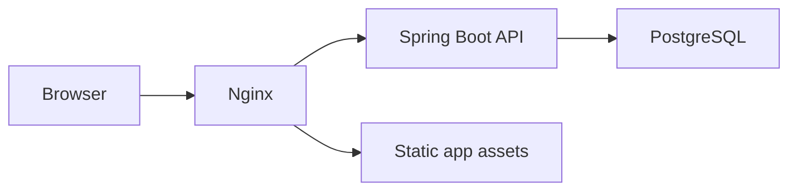

# TypeThock architecture

Status: implemented release-1 architecture; local verification complete
Last updated: 2026-07-26

## Decision summary

TypeThock uses a modular monorepo with a React single-page application, a Spring Boot JSON API, and PostgreSQL. It is a modular monolith, not a microservice system.

| Area | Choice | Reason |
| --- | --- | --- |
| Backend | Java 21 target, Spring Boot 4.1, Maven | Current stable Spring line with a widely deployable LTS bytecode target |
| Frontend | React 19.2, React Router 8.3, strict TypeScript, Vite 8 on Node 24 | Small client-only app, fast build/dev loop, no SSR requirement |
| Database | PostgreSQL 18, Flyway migrations | Durable relational constraints, current supported release |
| Test database | PostgreSQL 18 Testcontainers | Exercise the real migrations, constraints, timestamp, index, and concurrency behavior |
| Auth | Revocable opaque sessions in HttpOnly cookies; token hashes in PostgreSQL | Avoid browser bearer-token storage; support logout/revocation and multiple app instances |
| CSRF | Spring Security token repository plus required request header | Cookie auth needs an explicit CSRF control; SameSite is defense in depth |
| Deployment | Same-origin browser edge + Spring API + PostgreSQL. Compose uses Nginx; the zero-cost profile uses a Vercel external rewrite, Render, and Neon. | Preserve host-only cookies and CSRF while allowing either an operator-owned or free hobby topology |
| Client state | React reducer/hooks and small context providers | Domain is compact; a global state library would add little value |
| Charts | Hand-authored SVG plus native range scrubber | Keep four lightweight measured series dependency-free while exposing every point to pointer, keyboard, touch, and assistive technology |

No third-party runtime script, analytics SDK, UI kit, state library, or animation library is used.

## Repository shape

```text
typethock/
  backend/
    pom.xml
    src/main/java/com/typethock/typing/
      auth/
      result/
      security/
      common/
      config/
    src/main/resources/
      application.yml
      db/migration/
    src/test/
  frontend/
    src/
      api/
      app/
      components/
      features/auth/
      features/history/
      features/typing/
      styles/
      test/
    e2e/
  docs/
    product/
    architecture/
    design/
    security/
    operations/
  scripts/
  .github/workflows/
  compose.yaml
```

Dependencies point inward toward feature domain logic. Controllers do not contain persistence logic; React components do not contain scoring formulas.

## Runtime components



- Nginx serves immutable fingerprinted frontend assets and proxies `/api/*` and the public health endpoint.
- Spring Boot handles JSON validation, authentication, authorization, canonical score derivation, persistence, and problem responses.
- PostgreSQL stores users, session hashes, and typing results.
- The browser owns active typing state, prompt generation, local guest history, and presentation. It never persists an authentication secret.

## Backend boundaries

### `auth`

- Register with an ASCII-allowlisted, normalized unique username and a password of at least 12 code points and at most 72 UTF-8 bytes.
- Authenticate with delegating `{bcrypt}` hashes at strength 12, including a dummy verification for unknown usernames.
- Create a 256-bit random session token; return the raw token only in an HttpOnly cookie and store only SHA-256 token hash.
- Expire, revoke, and periodically update last-seen timestamps without extending sessions on every request.
- Export the authenticated user’s account data.
- Delete the authenticated account after password confirmation; database cascades remove sessions/results.

### `security`

- Resolve the session cookie in one filter and construct the authenticated principal.
- Enforce ownership from the principal, never from a client-supplied user id.
- Apply `CookieCsrfTokenRepository` CSRF to every state-changing endpoint, including register/login; bootstrap through the session endpoint.
- Apply exact development CORS origins; production is same-origin.
- Apply security response headers and a constrained CSP.
- Combine Nginx source-address limits with a bounded per-username login limiter in the API; never trust arbitrary forwarding headers.

### `result`

- Validate mode, mode value, modifiers, duration, character counts, and pace samples.
- Recalculate WPM/raw WPM/accuracy on the server.
- Persist an immutable result for the authenticated user.
- Return cursor-paginated history and aggregate records.
- Never expose another user’s result or internal database id.

### `common`

- RFC 9457-style `ProblemDetail` responses with stable application error codes.
- Request correlation id accepted/generated within a bounded safe format.
- No stack traces, SQL details, password hashes, session values, or raw credentials in responses/logs.

## Data model

### `app_user`

| Column | Type | Constraint |
| --- | --- | --- |
| `id` | UUID | primary key, random |
| `username` | varchar(24) | display value |
| `username_normalized` | varchar(24) | unique, lowercase |
| `password_hash` | varchar(255) | non-null, algorithm-prefixed |
| `created_at` | timestamptz | non-null |

### `auth_session`

| Column | Type | Constraint |
| --- | --- | --- |
| `id` | UUID | primary key |
| `user_id` | UUID | FK to user, cascade delete |
| `token_hash` | char(64) | unique, non-null |
| `created_at` | timestamptz | non-null |
| `last_seen_at` | timestamptz | non-null |
| `expires_at` | timestamptz | non-null, indexed |

### `typing_result`

| Column | Type | Constraint |
| --- | --- | --- |
| `id` | UUID | public primary key |
| `user_id` | UUID | FK to user, cascade delete, indexed with completion time |
| `client_result_id` | UUID | non-null, unique with `user_id` for idempotency |
| `mode` | varchar(8) | `TIME` or `WORDS` |
| `mode_value` | smallint | allowlisted by service |
| `punctuation` / `numbers` | boolean | non-null |
| `content_type` | varchar(8) | `WORDS`, `QUOTE`, `CUSTOM`, or `CODE` |
| `language` | varchar(2) | `EN` or `ES`; quotes and code are English |
| `code_language` | varchar(16), nullable | required for `CODE`; eight allowlisted programming languages |
| `error_policy` | varchar(8) | `NORMAL` or `STRICT` |
| `duration_ms` | integer | bounded |
| `typed_characters` | integer | retained printable characters, bounded |
| `correct_attempts` / `incorrect_attempts` | integer | historical input precision, bounded |
| `correct_characters` | integer | whole-word credited text, bounded |
| `incorrect_characters` | integer | retained substitutions, bounded |
| `missing_characters` / `extra_attempts` | integer | distinct error categories, bounded |
| `corrected_errors` | integer | bounded |
| `wpm` / `raw_wpm` | numeric(8,2) | server-derived |
| `accuracy` / `consistency` | numeric(5,2) | bounded 0–100 |
| `pace_buckets` | text/JSON | bounded duration/count buckets |
| `completed_at` | timestamptz | server timestamp |

The schema uses database checks in addition to request validation for integrity-critical ranges. The exact request, idempotency, pagination, retention, and cookie contracts are in `docs/architecture/API_CONTRACT.md`.

## HTTP surface

| Method | Path | Auth | Purpose |
| --- | --- | --- | --- |
| GET | `/api/auth/session` | optional | Current account state and CSRF bootstrap |
| POST | `/api/auth/register` | anonymous | Create account and session |
| POST | `/api/auth/login` | anonymous | Create session |
| POST | `/api/auth/logout` | required | Revoke current session |
| GET | `/api/account/export` | required | Download the caller’s account data as JSON |
| DELETE | `/api/account` | required | Password-confirmed account deletion |
| POST | `/api/results` | required | Validate, derive, and store one result |
| GET | `/api/results` | required | Cursor-paginated caller-owned history |
| GET | `/api/results/summary` | required | Caller-owned totals and records |
| GET | `/actuator/health` | public | Liveness/readiness summary without sensitive detail |

All state-changing requests require the CSRF header. Request and response bodies use explicit DTOs; entities are never serialized directly.

## Typing engine

The frontend engine is a pure reducer with explicit commands:

- `PRINTABLE_CHARACTER`
- `BACKSPACE`
- `COMMIT_WORD`
- `TICK`
- `RESTART`
- `COMPLETE`

Side effects live outside the reducer:

- `performance.now()` is read by the controller hook and passed as data.
- Deadline checks precede every accepted input. A display clock is isolated from the prompt tree and publishes at no more than 10Hz; animation frames only wake it.
- Result persistence happens only after the reducer creates an immutable completion snapshot.
- Prompt generation is seeded/versioned and independently testable.
- The visual prompt is an 80-word, line-paged window with stable keys. It never
  drops a word on each commit: it advances by a complete visual row and rebases
  only at a row boundary. No API/client context update is subscribed in the key
  handler.

## Consistency and failure rules

- Guest results commit to local storage after completion.
- Signed-in results post once after completion. The result screen does not wait for the request.
- A retryable failed account save remains in a 20-entry queue scoped to the
  originating account id. Permanent 4xx failures are discarded without
  blocking older entries; saturation rejects the new entry without evicting
  existing queued data. Pending entries are visible in account history and
  retry only for that same account. Guest runs never auto-upload.
- Duplicate save prevention uses a client-generated result UUID accepted once per user via a unique database constraint.
- API errors use a central fetch client with same-origin paths, credentials, CSRF header injection, timeout, and parsed problem responses.

## Configuration

Runtime secrets and environment-dependent values:

- `TYPETHOCK_DATABASE_URL`
- `TYPETHOCK_DATABASE_USERNAME`
- `TYPETHOCK_DATABASE_PASSWORD`
- `TYPETHOCK_COOKIE_SECURE` (must be true in production)
- `TYPETHOCK_ALLOWED_ORIGINS` (development only; exact origins)

Production fails fast for missing database configuration, disabled Secure cookies, or non-empty production CORS origins. `.env.example` contains names and safe examples, never credentials suitable for production.

## Verification strategy

- Backend: JUnit 5, service tests, MockMvc full-filter-chain API/security tests, and PostgreSQL 18 Testcontainers migration/repository/concurrency tests.
- Frontend: Vitest, Testing Library, fake timers, reducer/property-style table tests, axe checks.
- End to end: Playwright keyboard workflows and API-offline behavior at desktop and mobile viewports.
- Static: TypeScript strict, ESLint, Maven compiler/test checks, dependency audits, secret-pattern scan.
- Runtime: response-header checks, console inspection, health endpoint, screenshot review.
- Deployment: clean Docker Compose build and health check when Docker is available.

## Deferred architecture

Email workflows, OAuth, a shared/distributed limiter, preference sync, and a dedicated observability backend are intentionally deferred. They are not needed for a correct single-instance first release and would materially widen the threat and maintenance surface. Expired-session cleanup, concurrency-safe active-session limits, and a 1,000-result rolling retention cap are in release 1.
